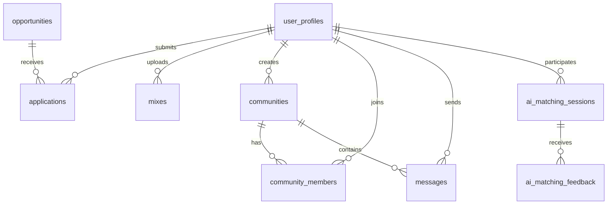

# R/HOOD Studio - Technical Architecture Guide

## 🏗️ System Architecture

### **High-Level Architecture**
```
┌─────────────────┐    ┌─────────────────┐    ┌─────────────────┐
│   Frontend      │    │   Backend       │    │   Database      │
│   (Next.js)     │◄──►│   (Supabase)    │◄──►│   (PostgreSQL)  │
│                 │    │                 │    │                 │
│ • React 18      │    │ • Auth          │    │ • Tables        │
│ • Tailwind CSS  │    │ • API           │    │ • RLS Policies  │
│ • Radix UI      │    │ • Storage       │    │ • Indexes       │
│ • TypeScript    │    │ • Real-time     │    │ • Functions     │
└─────────────────┘    └─────────────────┘    └─────────────────┘
```

### **Technology Stack Details**

#### **Frontend Layer**
- **Next.js 15**: React framework with App Router
- **React 18**: Component library with hooks
- **TypeScript**: Type-safe development
- **Tailwind CSS**: Utility-first CSS framework
- **Radix UI**: Accessible component primitives
- **Shadcn/ui**: Pre-built component library

#### **Backend Layer**
- **Supabase**: Backend-as-a-Service platform
- **PostgreSQL**: Relational database
- **Row Level Security**: Database-level access control
- **Real-time Subscriptions**: Live data updates
- **Edge Functions**: Serverless functions

#### **Infrastructure**
- **Vercel**: Deployment and hosting
- **Supabase Storage**: File storage service
- **CDN**: Global content delivery
- **SSL/TLS**: Secure connections

## 🗄️ Database Schema

### **Core Tables Overview**
```sql
-- User Management
user_profiles (id, first_name, last_name, dj_name, email, city, genres, bio, instagram, soundcloud, profile_image_url, created_at, updated_at)

-- Opportunity Management
opportunities (id, title, description, location, event_date, payment, genre, skill_level, organizer_name, is_active, created_at, updated_at)

-- Application System
applications (id, user_id, opportunity_id, status, message, created_at, updated_at)

-- Mix Management
mixes (id, title, artist, genre, description, status, file_url, file_name, file_size, duration, image_url, uploaded_by, created_at, updated_at)

-- Community System
communities (id, name, description, creator_id, created_at, updated_at)
community_members (id, community_id, user_id, joined_at)
messages (id, community_id, sender_id, content, edited_at, created_at)

-- AI Features
ai_matching_sessions (id, user_id, opportunity_id, matching_score, feedback, created_at)
ai_matching_feedback (id, session_id, user_id, rating, feedback_text, created_at)
```

### **Table Relationships**


### **Indexes for Performance**
```sql
-- User profiles indexes
CREATE INDEX idx_user_profiles_email ON user_profiles(email);
CREATE INDEX idx_user_profiles_dj_name ON user_profiles(dj_name);
CREATE INDEX idx_user_profiles_city ON user_profiles(city);
CREATE INDEX idx_user_profiles_created_at ON user_profiles(created_at);

-- Opportunities indexes
CREATE INDEX idx_opportunities_event_date ON opportunities(event_date);
CREATE INDEX idx_opportunities_is_active ON opportunities(is_active);
CREATE INDEX idx_opportunities_genre ON opportunities(genre);

-- Applications indexes
CREATE INDEX idx_applications_user_id ON applications(user_id);
CREATE INDEX idx_applications_opportunity_id ON applications(opportunity_id);
CREATE INDEX idx_applications_status ON applications(status);

-- Mixes indexes
CREATE INDEX idx_mixes_artist ON mixes(artist);
CREATE INDEX idx_mixes_genre ON mixes(genre);
CREATE INDEX idx_mixes_uploaded_by ON mixes(uploaded_by);

-- Community indexes
CREATE INDEX idx_community_members_community_id ON community_members(community_id);
CREATE INDEX idx_community_members_user_id ON community_members(user_id);
CREATE INDEX idx_messages_community_id ON messages(community_id);
CREATE INDEX idx_messages_created_at ON messages(created_at);
```

## 🔐 Security Architecture

### **Authentication Flow**
```
1. User Login Request
   ↓
2. Supabase Auth Validation
   ↓
3. JWT Token Generation
   ↓
4. Session Establishment
   ↓
5. Route Protection Check
   ↓
6. Admin Access Granted
```

### **Row Level Security Policies**
```sql
-- User profiles policies
CREATE POLICY "Admins can view all user profiles" ON user_profiles
  FOR SELECT USING (true);

CREATE POLICY "Admins can insert user profiles" ON user_profiles
  FOR INSERT WITH CHECK (true);

CREATE POLICY "Admins can update user profiles" ON user_profiles
  FOR UPDATE USING (true);

CREATE POLICY "Admins can delete user profiles" ON user_profiles
  FOR DELETE USING (true);

-- Opportunities policies
CREATE POLICY "Admins can manage opportunities" ON opportunities
  FOR ALL USING (true);

-- Applications policies
CREATE POLICY "Admins can manage applications" ON applications
  FOR ALL USING (true);

-- Mixes policies
CREATE POLICY "Admins can manage mixes" ON mixes
  FOR ALL USING (true);

-- Community policies
CREATE POLICY "Admins can manage communities" ON communities
  FOR ALL USING (true);

CREATE POLICY "Admins can manage community members" ON community_members
  FOR ALL USING (true);

CREATE POLICY "Admins can manage messages" ON messages
  FOR ALL USING (true);
```

### **Data Protection Measures**
- **Input Validation**: All user inputs are validated
- **SQL Injection Prevention**: Parameterized queries only
- **XSS Protection**: Content sanitization
- **CSRF Protection**: Cross-site request forgery prevention
- **File Upload Security**: Type validation and virus scanning
- **Encryption**: Data encrypted in transit and at rest

## 🚀 Performance Optimization

### **Frontend Optimizations**
```typescript
// Code splitting with dynamic imports
const LazyComponent = dynamic(() => import('./Component'), {
  loading: () => <Skeleton />,
  ssr: false
});

// Image optimization
<Image
  src="/image.jpg"
  alt="Description"
  width={500}
  height={300}
  placeholder="blur"
  blurDataURL="data:image/jpeg;base64,..."
  loading="lazy"
  priority={false}
/>

// Memoization for expensive calculations
const MemoizedComponent = React.memo(({ data }) => {
  const processedData = useMemo(() => {
    return expensiveCalculation(data);
  }, [data]);
  
  return <div>{processedData}</div>;
});
```

### **Database Optimizations**
```sql
-- Query optimization examples
-- Use specific column selection
SELECT id, title, status FROM applications WHERE status = 'pending';

-- Use proper joins
SELECT u.dj_name, o.title, a.status
FROM applications a
JOIN user_profiles u ON a.user_id = u.id
JOIN opportunities o ON a.opportunity_id = o.id
WHERE a.status = 'pending';

-- Use pagination
SELECT * FROM user_profiles
ORDER BY created_at DESC
LIMIT 20 OFFSET 0;

-- Use prepared statements
PREPARE get_user_by_email AS
SELECT * FROM user_profiles WHERE email = $1;
```

### **Caching Strategy**
```typescript
// React Query for data caching
const { data: opportunities, isLoading } = useQuery({
  queryKey: ['opportunities'],
  queryFn: fetchOpportunities,
  staleTime: 5 * 60 * 1000, // 5 minutes
  cacheTime: 10 * 60 * 1000, // 10 minutes
});

// Local storage for user preferences
const saveUserPreferences = (preferences: UserPreferences) => {
  localStorage.setItem('userPreferences', JSON.stringify(preferences));
};

// Session storage for temporary data
const saveTemporaryData = (data: any) => {
  sessionStorage.setItem('tempData', JSON.stringify(data));
};
```

## 🔄 Data Flow Architecture

### **Application State Management**
```typescript
// Global state with React Context
const AppContext = createContext<AppState | undefined>(undefined);

const AppProvider = ({ children }: { children: React.ReactNode }) => {
  const [user, setUser] = useState<User | null>(null);
  const [loading, setLoading] = useState(true);
  
  const value = {
    user,
    setUser,
    loading,
    setLoading
  };
  
  return (
    <AppContext.Provider value={value}>
      {children}
    </AppContext.Provider>
  );
};

// Custom hooks for state access
const useApp = () => {
  const context = useContext(AppContext);
  if (context === undefined) {
    throw new Error('useApp must be used within an AppProvider');
  }
  return context;
};
```

### **API Integration Pattern**
```typescript
// Supabase client configuration
const supabase = createClient(
  process.env.NEXT_PUBLIC_SUPABASE_URL!,
  process.env.NEXT_PUBLIC_SUPABASE_ANON_KEY!
);

// Data fetching with error handling
const fetchOpportunities = async (): Promise<Opportunity[]> => {
  try {
    const { data, error } = await supabase
      .from('opportunities')
      .select('*')
      .eq('is_active', true)
      .order('created_at', { ascending: false });
    
    if (error) throw error;
    return data || [];
  } catch (error) {
    console.error('Error fetching opportunities:', error);
    throw error;
  }
};

// Real-time subscriptions
const subscribeToApplications = (callback: (application: Application) => void) => {
  return supabase
    .channel('applications')
    .on('postgres_changes', {
      event: 'INSERT',
      schema: 'public',
      table: 'applications'
    }, callback)
    .subscribe();
};
```

## 🎨 Component Architecture

### **Component Hierarchy**
```
App
├── AdminLayout
│   ├── Sidebar
│   │   ├── Navigation
│   │   └── UserMenu
│   ├── Header
│   │   ├── Breadcrumbs
│   │   └── Actions
│   └── MainContent
│       ├── Dashboard
│       ├── Opportunities
│       ├── Applications
│       ├── Mixes
│       ├── Members
│       └── Communities
└── AuthProvider
```

### **Component Design Patterns**
```typescript
// Compound component pattern
const Card = {
  Root: CardRoot,
  Header: CardHeader,
  Content: CardContent,
  Footer: CardFooter
};

// Usage
<Card.Root>
  <Card.Header>
    <Card.Title>Title</Card.Title>
  </Card.Header>
  <Card.Content>
    Content here
  </Card.Content>
</Card.Root>

// Render props pattern
interface DataFetcherProps<T> {
  children: (data: T[], loading: boolean, error: Error | null) => React.ReactNode;
  queryKey: string;
  queryFn: () => Promise<T[]>;
}

const DataFetcher = <T,>({ children, queryKey, queryFn }: DataFetcherProps<T>) => {
  const { data, isLoading, error } = useQuery({
    queryKey: [queryKey],
    queryFn
  });
  
  return <>{children(data || [], isLoading, error)}</>;
};

// Higher-order component pattern
const withAuth = <P extends object>(Component: React.ComponentType<P>) => {
  return (props: P) => {
    const { user, loading } = useAuth();
    
    if (loading) return <LoadingSpinner />;
    if (!user) return <LoginPage />;
    
    return <Component {...props} />;
  };
};
```

## 🔧 Development Workflow

### **Code Organization**
```
src/
├── components/
│   ├── ui/                 # Reusable UI components
│   ├── forms/              # Form components
│   ├── layout/             # Layout components
│   └── features/           # Feature-specific components
├── hooks/
│   ├── useAuth.ts          # Authentication hook
│   ├── useSupabase.ts      # Supabase integration
│   └── useLocalStorage.ts  # Local storage hook
├── lib/
│   ├── utils.ts            # Utility functions
│   ├── validations.ts      # Form validations
│   ├── date-utils.ts        # Date formatting
│   └── constants.ts        # Application constants
├── types/
│   ├── database.ts         # Database types
│   ├── api.ts              # API response types
│   └── components.ts       # Component prop types
└── integrations/
    ├── supabase/
    │   ├── client.ts       # Supabase client
    │   └── types.ts        # Generated types
    └── auth/
        └── provider.ts     # Auth provider
```

### **TypeScript Configuration**
```json
{
  "compilerOptions": {
    "target": "ES2020",
    "lib": ["dom", "dom.iterable", "ES6"],
    "allowJs": true,
    "skipLibCheck": true,
    "strict": true,
    "forceConsistentCasingInFileNames": true,
    "noEmit": true,
    "esModuleInterop": true,
    "module": "esnext",
    "moduleResolution": "node",
    "resolveJsonModule": true,
    "isolatedModules": true,
    "jsx": "preserve",
    "incremental": true,
    "plugins": [
      {
        "name": "next"
      }
    ],
    "baseUrl": ".",
    "paths": {
      "@/*": ["./src/*"],
      "@/components/*": ["./src/components/*"],
      "@/lib/*": ["./src/lib/*"],
      "@/hooks/*": ["./src/hooks/*"]
    }
  }
}
```

### **Build Process**
```bash
# Development
npm run dev          # Start development server
npm run build        # Build for production
npm run start        # Start production server
npm run lint         # Run ESLint
npm run type-check   # Run TypeScript checks

# Testing
npm run test         # Run unit tests
npm run test:e2e     # Run end-to-end tests
npm run test:coverage # Run tests with coverage

# Deployment
npm run deploy       # Deploy to Vercel
npm run db:migrate   # Run database migrations
npm run db:seed      # Seed database with test data
```

## 📊 Monitoring & Analytics

### **Performance Monitoring**
```typescript
// Web Vitals tracking
import { getCLS, getFID, getFCP, getLCP, getTTFB } from 'web-vitals';

const sendToAnalytics = (metric: any) => {
  // Send to analytics service
  console.log(metric);
};

getCLS(sendToAnalytics);
getFID(sendToAnalytics);
getFCP(sendToAnalytics);
getLCP(sendToAnalytics);
getTTFB(sendToAnalytics);

// Error boundary for error tracking
class ErrorBoundary extends React.Component {
  constructor(props: any) {
    super(props);
    this.state = { hasError: false };
  }

  static getDerivedStateFromError(error: Error) {
    return { hasError: true };
  }

  componentDidCatch(error: Error, errorInfo: React.ErrorInfo) {
    // Log error to monitoring service
    console.error('Error caught by boundary:', error, errorInfo);
  }

  render() {
    if (this.state.hasError) {
      return <ErrorFallback />;
    }

    return this.props.children;
  }
}
```

### **Database Monitoring**
```sql
-- Query performance monitoring
SELECT 
  query,
  calls,
  total_time,
  mean_time,
  rows
FROM pg_stat_statements
ORDER BY total_time DESC
LIMIT 10;

-- Table size monitoring
SELECT 
  schemaname,
  tablename,
  pg_size_pretty(pg_total_relation_size(schemaname||'.'||tablename)) as size
FROM pg_tables
ORDER BY pg_total_relation_size(schemaname||'.'||tablename) DESC;

-- Index usage monitoring
SELECT 
  schemaname,
  tablename,
  indexname,
  idx_tup_read,
  idx_tup_fetch
FROM pg_stat_user_indexes
ORDER BY idx_tup_read DESC;
```

## 🚀 Deployment Architecture

### **Vercel Deployment**
```json
{
  "builds": [
    {
      "src": "package.json",
      "use": "@vercel/next"
    }
  ],
  "env": {
    "NEXT_PUBLIC_SUPABASE_URL": "@supabase-url",
    "NEXT_PUBLIC_SUPABASE_ANON_KEY": "@supabase-anon-key"
  }
}
```

### **Environment Configuration**
```bash
# Production
NEXT_PUBLIC_SUPABASE_URL=https://your-project.supabase.co
NEXT_PUBLIC_SUPABASE_ANON_KEY=your-anon-key
NODE_ENV=production

# Staging
NEXT_PUBLIC_SUPABASE_URL=https://your-staging-project.supabase.co
NEXT_PUBLIC_SUPABASE_ANON_KEY=your-staging-anon-key
NODE_ENV=staging

# Development
NEXT_PUBLIC_SUPABASE_URL=https://your-dev-project.supabase.co
NEXT_PUBLIC_SUPABASE_ANON_KEY=your-dev-anon-key
NODE_ENV=development
```

### **CI/CD Pipeline**
```yaml
# .github/workflows/deploy.yml
name: Deploy to Vercel

on:
  push:
    branches: [main]
  pull_request:
    branches: [main]

jobs:
  deploy:
    runs-on: ubuntu-latest
    steps:
      - uses: actions/checkout@v2
      - uses: actions/setup-node@v2
        with:
          node-version: '18'
      - run: npm ci
      - run: npm run build
      - run: npm run test
      - uses: amondnet/vercel-action@v20
        with:
          vercel-token: ${{ secrets.VERCEL_TOKEN }}
          vercel-org-id: ${{ secrets.ORG_ID }}
          vercel-project-id: ${{ secrets.PROJECT_ID }}
          vercel-args: '--prod'
```

## 🔮 Future Architecture Considerations

### **Scalability Planning**
- **Microservices**: Break down into smaller services
- **CDN**: Global content delivery network
- **Caching**: Redis for session and data caching
- **Load Balancing**: Distribute traffic across instances
- **Database Sharding**: Partition data across multiple databases

### **Technology Upgrades**
- **React 19**: Latest React features
- **Next.js 16**: Enhanced performance
- **PostgreSQL 16**: Latest database features
- **TypeScript 5**: Improved type system
- **Tailwind CSS 4**: Enhanced styling capabilities

### **Security Enhancements**
- **Zero Trust**: Implement zero-trust security model
- **API Gateway**: Centralized API management
- **Rate Limiting**: Prevent abuse and DDoS
- **Audit Logging**: Comprehensive activity tracking
- **Penetration Testing**: Regular security assessments

This technical architecture guide provides a comprehensive overview of the R/HOOD Studio system architecture, implementation details, and future considerations. It serves as a reference for developers, system administrators, and technical stakeholders.
